# _Gitを使ったデプロイ(ロリポップマネージドクラウド)_
## GitHubにpushしたら、マネージドクラウドにも簡単に更新を反映させるデプロイ方法を実装
- いつも通りにGitにpushする

> ディレクトリを変更する  
```bash
cd 作業ディレクトリ
```

> 初期化  
```bash
git init
```

> リポジトリの登録  
```bash
git remote add origin リポジトリのurl
```
> 登録されているかどうかは以下のコマンドで確認できる  
```bash
git remote -v
```
> 実行結果  
> `origin	git@github.com:******/******.git (fetch)`  
> `origin	git@github.com:******/******.git (push)`  
> 間違っている場合は以下で登録し直す  
```bash
git remote set-url origin 正しいurl
```

## ファイルを add
```bash
git add .
```

## ファイルを commit
```bash
git commit -m"コミットメッセージ"
```

## ファイルを push
```bash
git push origin master
```

## PCからロリポップマネージドクラウドへのログイン
- [ロリポップ（マネージドクラウド）にログインする](https://mc.lolipop.jp/login)
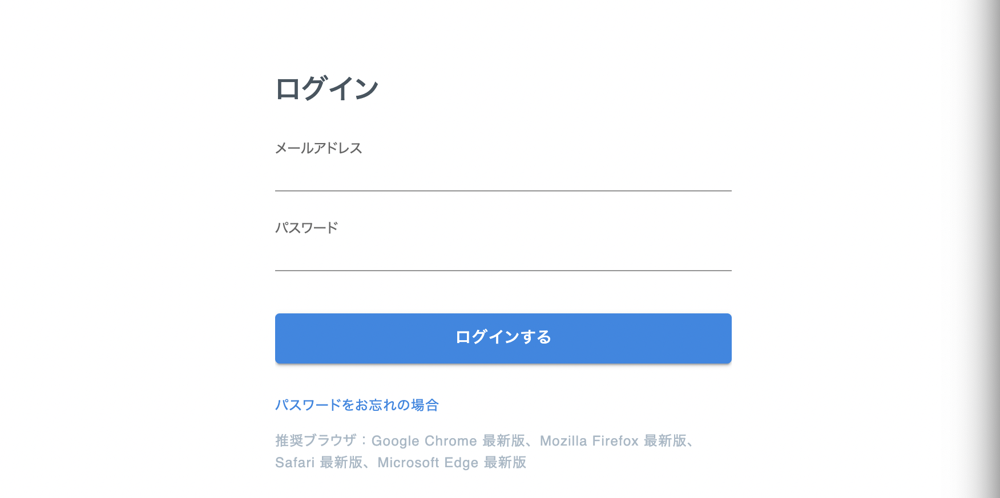

- プロジェクトの`新規追加`ボタンをクリックする
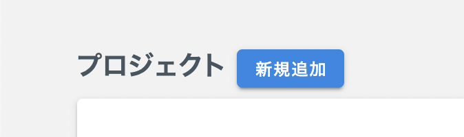


- 使用言語を選択する
> `次へ`ボタンをクリックする  
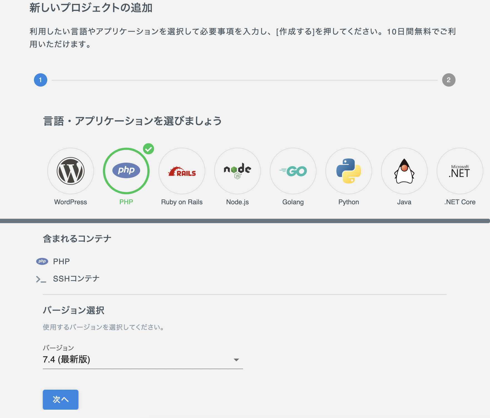

- プロジェクトの設定
> 必要項目を記入して次へをクリックする  
> `ドメイン＝URL`になる  
> `プロジェクト名＝プロジェクト名`にする  
> `データベースパスワード＝記録`する  
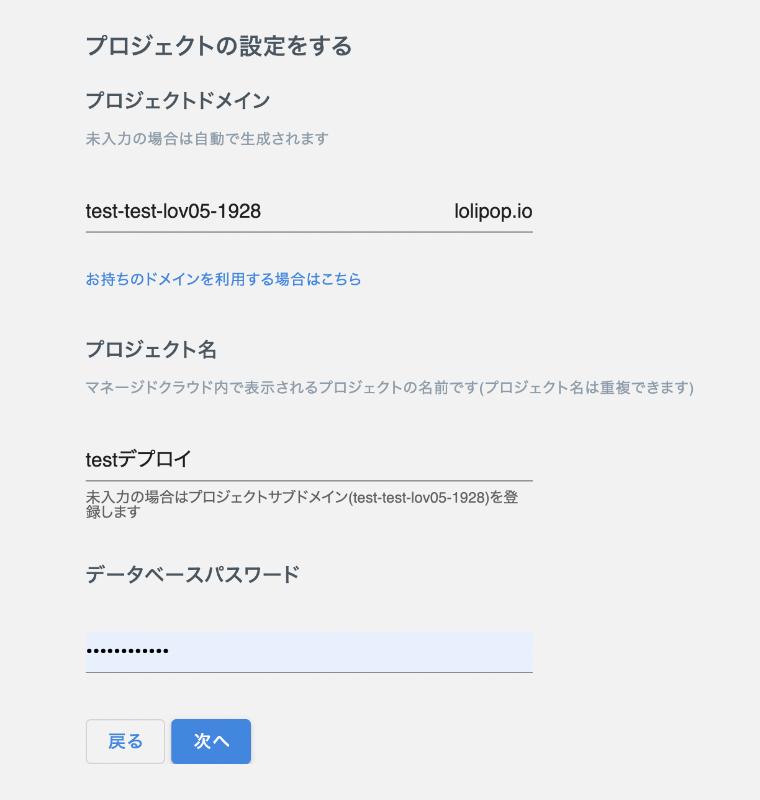

- 公開鍵を追加する
> ワンクリック登録で`key`を追加する  
> (一度作成すれば次からは同じものを使っていい)  
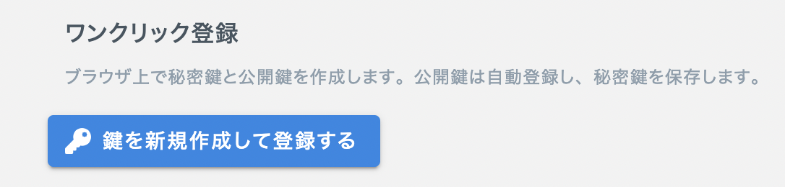

- ダウンロードされた`id-ファイル.txt`を大切に保管する
> `.ssh`に入れておくといいかも（名前も変更してわかりやすくしておく）  

- プロジェクト画面に戻り`SSHコマンド`を`ターミナル`で実行する  
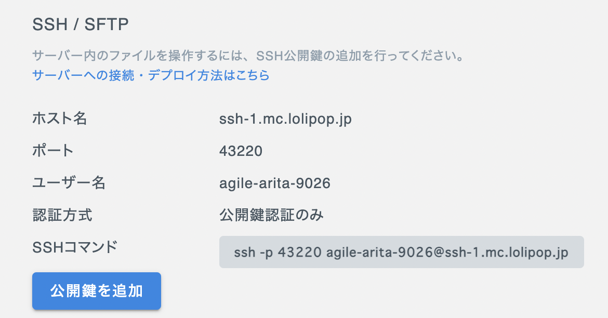

> 以下の画面が表示されればOK  
> (マネージドクラウドにログインした状態になる)  
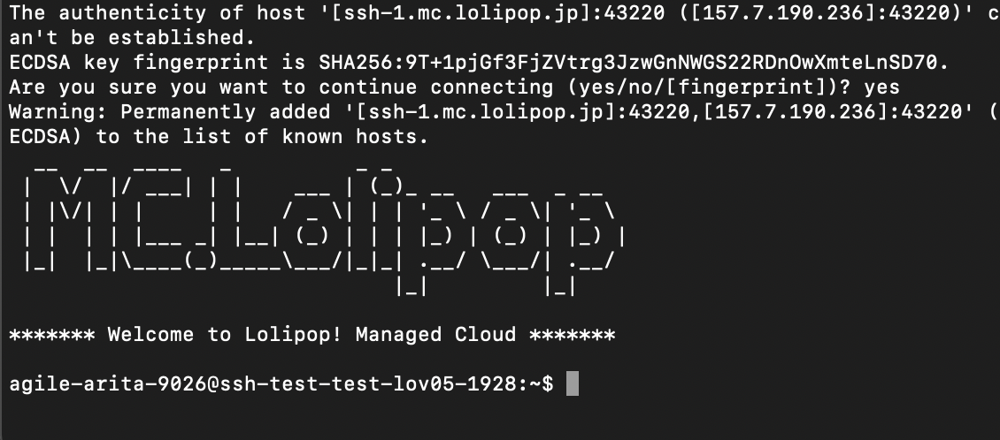

- `agile-arita-9026@ssh-test-test-lov05-1928:~$ `このような待機画面になっているか確認する
> ある程度時間が経過すると自動的にログアウトされるので，その場合は再度`SSHコマンド`を実行するとログインできる  

## ロリポップマネージドクラウドとGitHubのSSH通信設定
- Lolipopでの操作
> `ssh-key`を作成し，マネクラと`GitHub`の間で通信できるようにする  
> (マネージドクラウドの公開鍵と秘密鍵を作成)  
```bash
cd .ssh
ssh-keygen
```
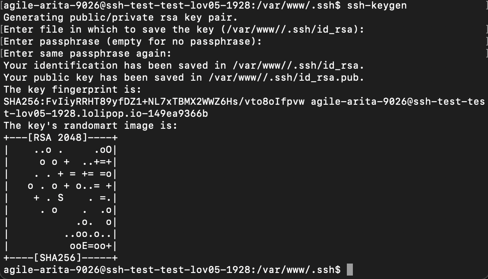

- ssh-keyの表示
> 作成したssh-keyを表示する  
```bash
cat id_rsa.pub
```
> 実行結果  
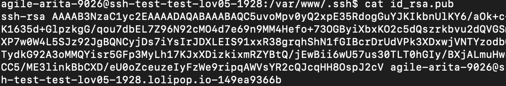

> 公開鍵を全てコピーする  

- ssh-keyの登録
> Gitに公開鍵を登録する  
> `New SSH Key`をクリックしてコピーした`Key`を登録する  
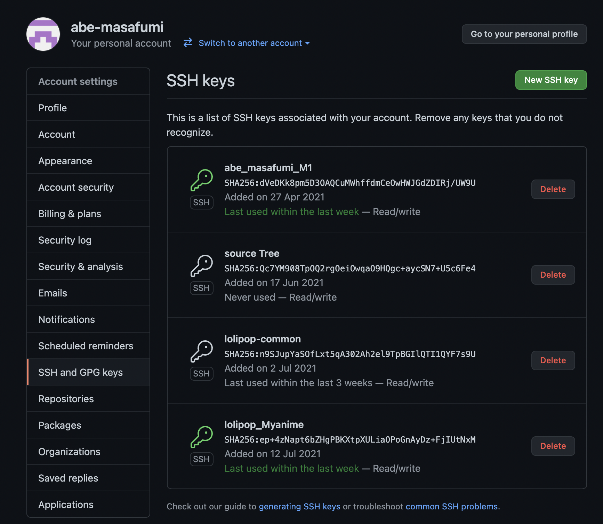


## GitHub上のコードをマネージドクラウドにデプロイ
- 階層を`/var/www`へ移動する
```bash
cd ..
```

- GitHub上のコードをデプロイ
```bash
git clone YOUR_REPOSITORY_URL project
```
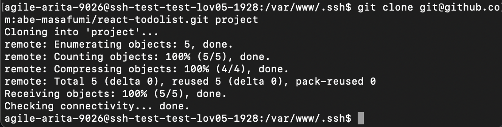

- `project`フォルダにプロジェクトがあるか確認する
```bash
cd project
ls 
```
> 自分が作成したプロジェクトが表示されればOK

# シンボリックリンクの作成
- ルートディレクトリを設定できないので，`/var/www/html`をシンボリックリンクにして`/var/www/project/public/`を参照する
```bash
rm -rf /var/www/html
ln -s /var/www/project/ /var/www/html
```

> ブラウザでプロジェクトのURLにアクセスして表示されればOK！  

# _編集したプロダクトをマネージドクラウドで更新する_
- 通常のターミナルで実行
```bash
git add .
git commit -m"コミットメッセージ"
git push origin master
```

- ロリポップマネージドクラウドへのログインした状態で実行
```bash
git pull origin master
```

> これで更新が完了する  

# 余談

- phpでデータベースを接続する場合は次の設定をする
- php/functionsの設定

> ロリポップの設定を見ながら入力する

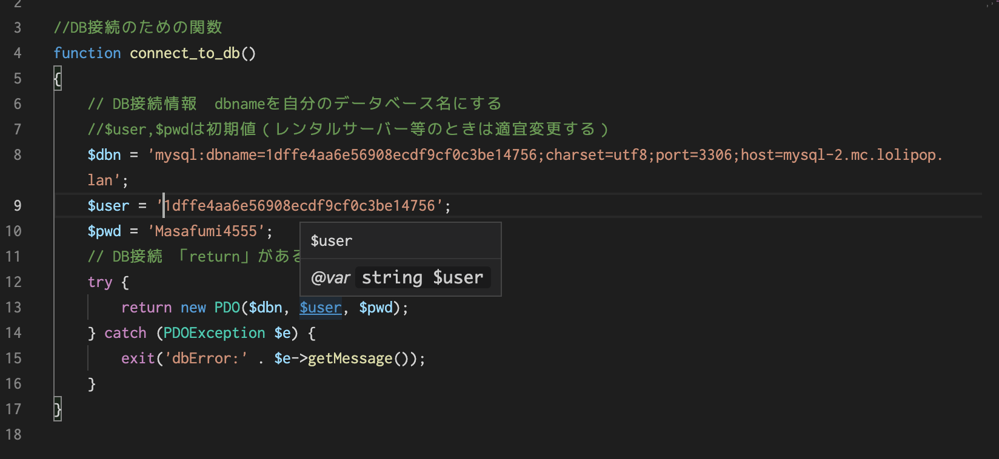

- workbenchの接続設定

> パスワードは１２文字

> id_rsaを使用

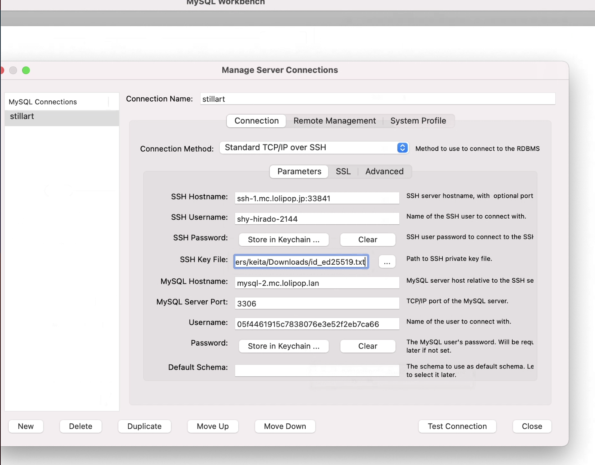


- データベースのimport

> Data Import/Restoreをクリック

> Import from Self-Contained FileにエクスポートしたDBファイルを選択
> Start Importでインポート（２回目くらいでいけた：反映されるのが遅い）

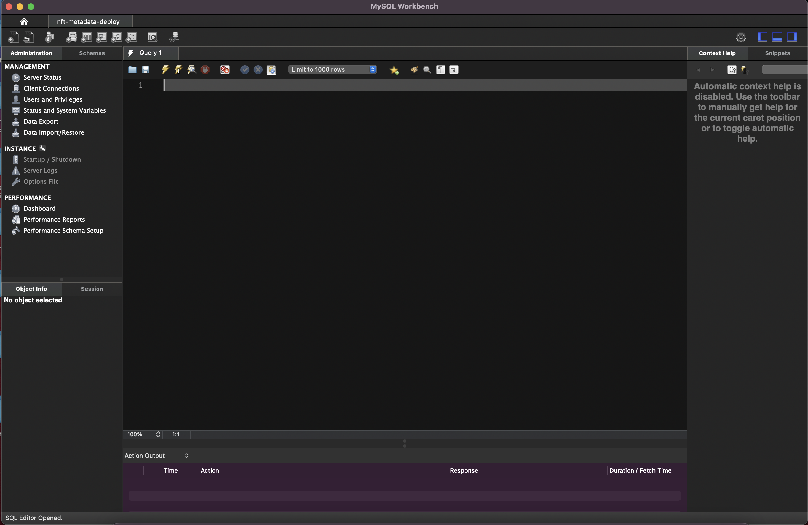

