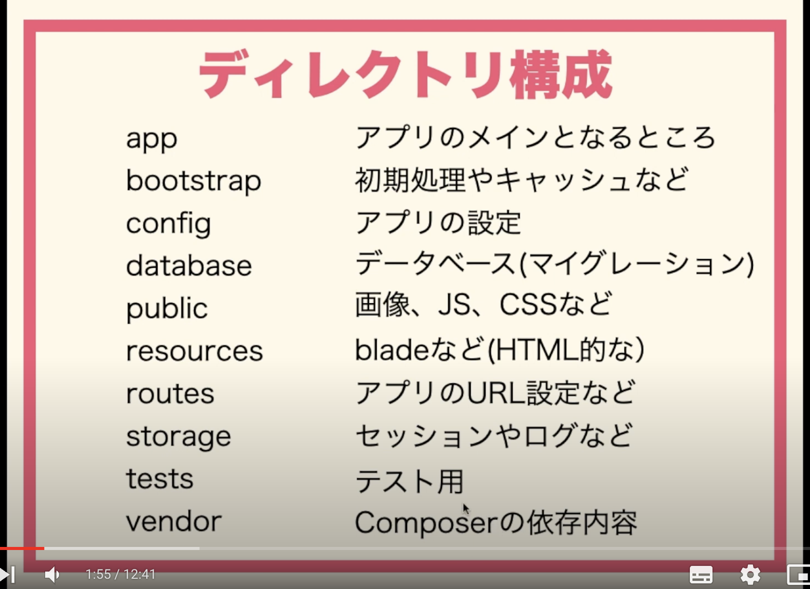
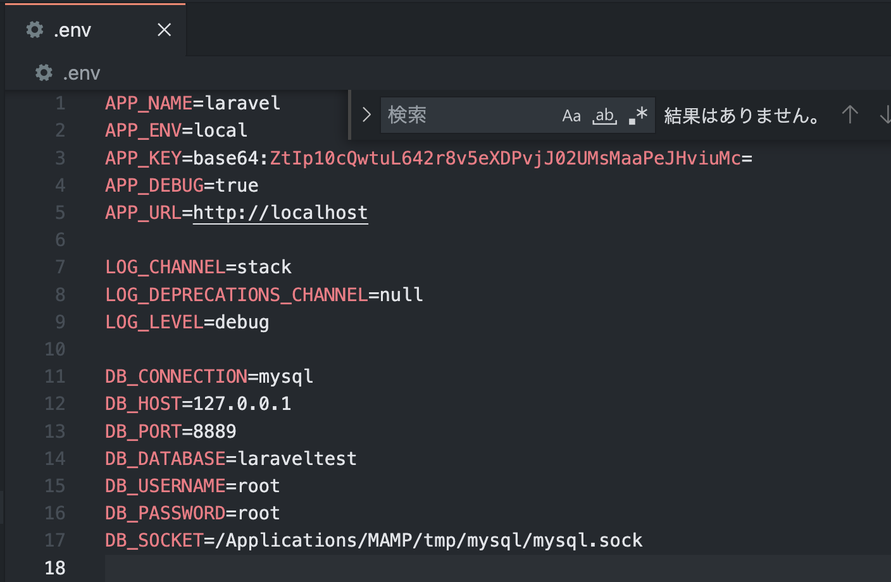
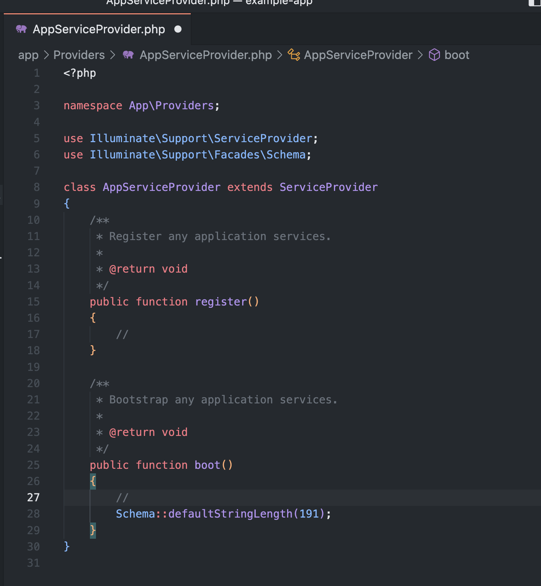
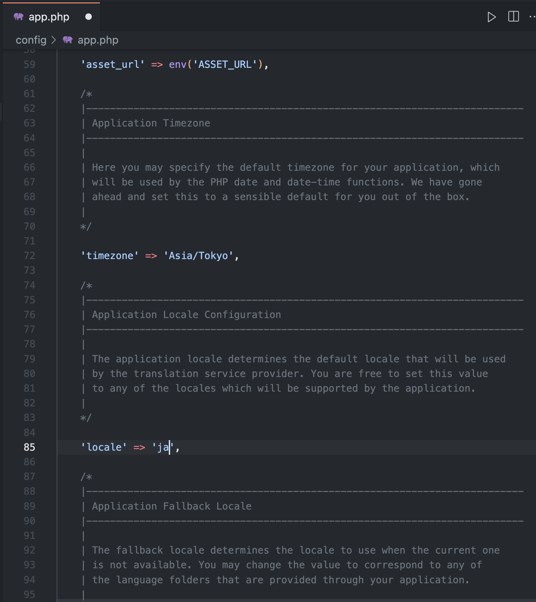
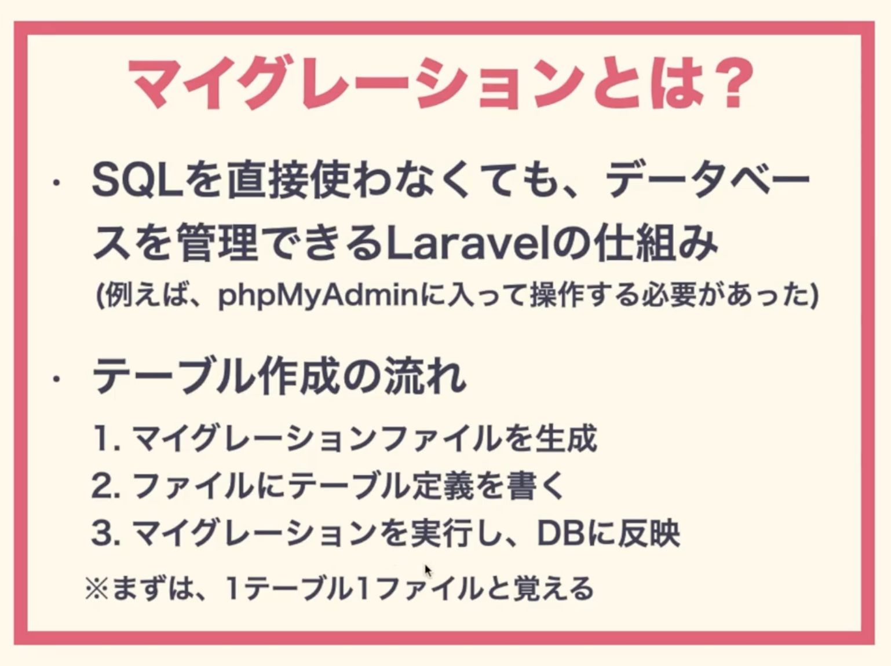
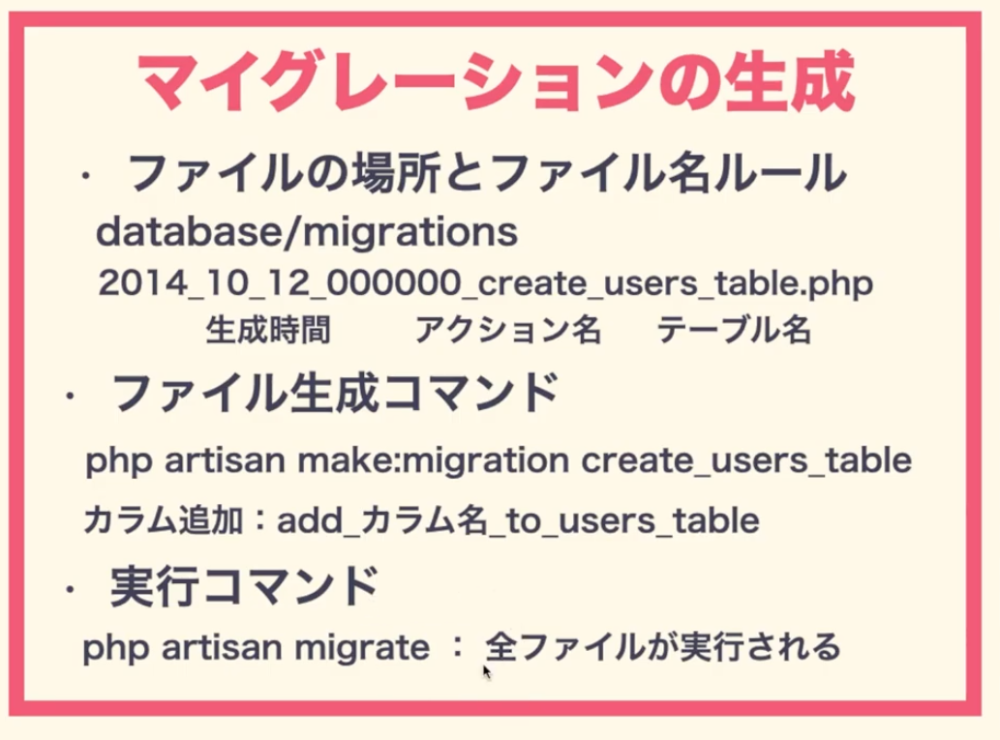

# Laravelno始め方

[ドキュメント](https://laravel.com/docs/9.x/migrations#generating-migrations)

[ドキュメント](https://readouble.com/laravel/9.x/ja/installation.html)

## 開発環境 ローカル
- Mac(PC)上に構築する　＝>MAMP

## 開発環境 仮想環境
- Vargant + VirtualBox

- Docker


## ローカル環境で構築
- Mac(PC)上に構築する　＝>MAMP

- Composerが必要

- 色々インストールする前に"brew upgrade"[Homebrewで覚えておくと便利なコマンド一覧](https://parashuto.com/rriver/tools/homebrew-most-used-commands)を実行

- [プロジェクトの作成](https://laravel.com/docs/9.x)

## プロジェクトのディレクトリ構成



## プロジェクトの環境設定

- .envでDBと接続設定



- 文字コード設定



- 詳細設定



- マイグレーションのとは



- マイグレーションの生成



"migrations/"の中にフォルダを作成
```bush
php artisan make:migration create_owners_table
```

接続しているDBにテーブルを生成
```bush
php artisan migrate
```


## Docker環境で構築

Docker Desktopのインストール
[Download Docker Desktop](https://docs.docker.com/desktop/mac/apple-silicon/)

"Homebrew"でインストールしようとしたが、Docker　Desktopだげがインストールできるか不安だったのでwebからダウンロードした

Dockerがインストールできているか確認
```
docker -v

docker compose -v
```

vscodeの拡張機能で"Dcker"をインストール

## Docker Desktopの使い方

[document](https://docs.docker.jp/)


一度チュートリアルをやってみるといい

## 手順

ローカルでプロジェクトを作成

コマンド

```bush

```


## sailでlaravelの環境構築

[document 環境構築](https://laravel.com/docs/9.x/sail#installing-sail-into-existing-applications)

```bush
プロジェクト立ち上げ
curl -s "https://laravel.build/example-app?with=mysql" | bash

プロジェクトに移動
cd example-app

Sail を既存のアプリケーションにインストールする
composer require laravel/sail --dev

＊ composer.jsonが更新される
＊ composer.lockが更新される

<!-- Sailのdocker-compose.ymlファイルをアプリケーションのルートに発行
php artisan sail:install

* docker-compose.yml
* phpunit.xml -->

プロジェクトの起動
./vendor/bin/sail up -d

http://localhost/

Sailのdocker-compose.ymlファイルをアプリケーションのルートに発行
php artisan sail:install --devcontainer

* "docker-compose.yml"の作成
* "phpunit.xml"の作成
* ".devcontainer/devcontainer.json"の作成

プロジェクトの停止
./vendor/bin/sail stop

sailのバージョン確認
sail php --version
```


## 初期設定

config/app.phpファイルの設定

[参考資料](https://qiita.com/miriwo/items/16a982a36e7a62c4c86a)


[document .env設定](https://laravel.com/docs/9.x#environment-based-configuration)


## youtubeでの解説

[youtube Link](https://www.youtube.com/watch?v=HHHN76dHrv0&list=PLf5KB8oI_L_3mXd4MoEw4DBwhmGiF5low&index=8)

## gitからあらかじめ用意された何かをclone

[clone してください](https://github.com/sho55/todo-app-laravel9)

tree構造

.
├── docker-compose.yml
└── docker-config
    ├── mysql
    │   ├── data
    │   │   ├── #ib_16384_0.dblwr
    │   │   ├── #innodb_temp
    │   │   │   ├── temp_1.ibt
    │   │   │   
    │   │   ├── auto.cnf
    │   │   ├── binlog.000001
    │   │   ├
    │   │   ├── mysql
    │   │   │   ├── general_log.CSM
    │   │   │   ├
    │   │   ├── mysql.ibd
    │   │   ├── performance_schema
    │   │   │   ├── accounts_145.sdi
    │   │   ├── private_key.pem
    │   │   ├── sys
    │   │   │   └── sys_config.ibd
    │   │   ├── sys1
    │   │   │   ├── failed_jobs.ibd
    │   │   ├── undo_001
    │   └── my.cnf
    ├── nginx
    │   ├── Dockerfile
    │   └── default.conf
    └── php
        ├── Dockerfile
        └── php.ini

## dockerの起動

```
docker-compose up -d
```

これでコンテナとイメージが作られます

```
docker ps
```

これでドッカーのIDを見る

webのところのIDをコピー

```
docker exec -it f30722cecbb8 bash
```

```
composer create-project laravel/laravel:^9.0 src
```

これでsrcの中に何か作られる


```
exit
```

一回でる

```
docker-compose stop
```

一回すトップしてファイルを修正していく

後で写真を入れ込む


```
docker-compose up -d

```
再度立ち上げ


これにアクセス

http://localhost:81/


```
docker exec -it xxxxxxxxx bash
```
再度webコンテナ内に入る

```
php artisan make:migration create_posts_table --create=posts
```

マイグレーションファイルの生成


## DBの接続設定を確認


.envファイルを開く

DB情報を編集

```
php artisan migrate:status
```

