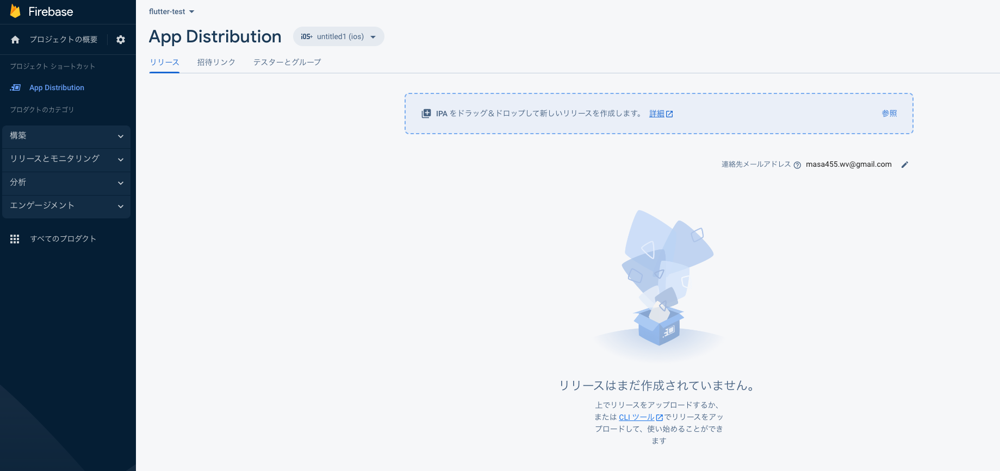

# flutter開発の流れ

[flutter Document](https://docs.flutter.dev/)  

---
- flutterで使えそうな記事  
[flutter サンプルプロジェクト](https://flutter.github.io/samples/#)  
[flutter コンポーネント](https://gallery.flutter.dev/#/)  

- flutter環境構築  
使用するツール   
github  
androidStudio  
Xcode  
Sumilator  

> 以前にflutterを使ったことがあったので今回は途中から環境構築  
> flutter doctorで足りないものを追加した感じ  

**参考資料**  
[android studioとgithubを連結](https://www.mechengjp.com/%E3%80%90flutter%E3%80%91android-studio%E3%81%A8github%E3%82%92%E9%80%A3%E6%90%BA%E3%81%99%E3%82%8B%E6%96%B9%E6%B3%95/)  
[CocoaPodsの使い方を徹底解説](https://ios-docs.dev/cocoapods/)  
[CocoaPodsとは](https://guides.cocoapods.org/using/getting-started.html#installation)  
[GitHubActionsでFirebaseAppDistributionの配布作業を自動化したい](https://zenn.dev/mamushi/scraps/627d5aafca4c88)  

- flutterで開発

"androidStudio"でサンプルプロジェクトを作成  

[firebaseと接続](https://firebase.google.com/docs/flutter/setup?authuser=0&hl=ja&platform=ios#available-plugins)  

- "App Distribution"でテストアプリの配布
"App Distribution"画面で  
"ios"は"IPA"ファイルをアップロードしてください  
"android"は"apk"ファイルをアップロードしてください  

"Android App Bundle"って方法が推奨されているらしい  
[Android App Bundle](https://developer.android.com/platform/technology/app-bundle)

しかし"App Distribution"でアプリを配布するにはAPKで出力する必要がある？   

**IOS**  

[参考資料](https://enoiu.com/app-develop/flutter-ios-release/)

```bush
flutter build ios --release
```
IPAファイルを作成のためにios版でbuildしようとしたらエラーが出た

参考資料  
[flutter build ipaコマンドを使ってみた](https://takamii.hatenablog.com/entry/2021/07/02/151453)

なんかXcodeとアップルIDを取得しろと言われた(すでに持っているけど)

参考資料  
[iPhoneアプリ開発環境の準備～Apple ID取得とX codeインストール](https://prokids.jp/article/iphone_pre)

エラー内容は先にappleで何か登録してください？って感じ？

```
flutter build ipa
```
このコマンドでもエラーが出る

[apple Developer account](https://developer.apple.com/account/)

**andoroid** 

[参考資料](https://gakogako.com/flutter_android_release/#%E3%83%AA%E3%83%AA%E3%83%BC%E3%82%B9%E3%83%93%E3%83%AB%E3%83%89%E3%82%92%E3%81%99%E3%82%8B)

```bush
flutter build apk" 
```

複数のエラーが出ながらもBuildが実行完了した。  
> "Built build/app/outputs/flutter-apk/app-release.apk"とか3つのファイルが自動生成される

apk
```bush
flutter build apk --split-per-abi
```

これでビルドしてできたファイルを"App Distribution"に貼り付けた  
ファイルの場所  "[project]/build/app/outputs/apk/release/app-armeabi-v7a-release.apk"  



- リリース  

[サヤパスが詰んでた⇨アップロード キーストアを作成する](https://docs.flutter.dev/deployment/android#signing-the-app)

- "github actions" と "App Distribution" を使ってアプリを自動配布

[youtube](https://youtu.be/BAXvzkgL15o)

[youtube](https://www.youtube.com/watch?v=9L7OfshBqX8)

**projectにworkflowを作成**
```yml
on:
  pull_request:
    branches:
      - master
  push:
    branches:
      - master

name: "Build & release"
jobs:
  build:
    name: build & relese
    runs-on: ubuntu-latest
    steps:
      - uses: actions/checkout@v3
      - uses: actions/setup-java@v3
        with:
          java-version: '17.x'
          # これがないとエラーになった
          distribution: 'temurin'
      - uses: subosito/flutter-action@v2
        with:
          flutter-version: '3.0.5'
      - run: flutter pub get 
      # importのコードをクイックフィックスで修正
      - run: flutter analyze
      - run: flutter test
      - run: flutter build apk --debug --split-per-abi
      - name: Push to Releases
        uses: ncipollo/release-action@v1
        with:
          artifacts: "build/app/outputs/apk/debug/*"
          tag: v1.0.${{ github.run_number }}
          token: ${{ secrets.TOKEN }}
      - name: upload artifact to Firebase App Distribution
        uses: wzieba/Firebase-Distribution-Github-Action@v1
        with:
          appId: ${{secrets.FIREBASE_APP_ID}}
          token: ${{secrets.FIREBASE_TOKEN}}
          # App Distributionのテスト配布グループ名
          groups: test
          # ここは一度ローカルでbuildしてファイル名をコピペするのが確実
          file: build/app/outputs/apk/debug/app-armeabi-v7a-debug.apk
```

**secretsの作成**
<!-- 自分のgithubアカウントのトークンを作成し、プロジェクトと紐付ける -->
> secrets.TOKEN 
<!-- firebaseのAndoroid用のIDを紐づける -->
> secrets.FIREBASE_APP_ID
<!-- firebaseのログイン時のトークンと紐づける -->
> secrets.FIREBASE_TOKEN
